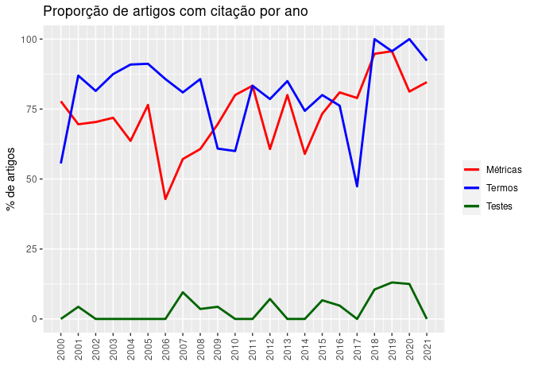
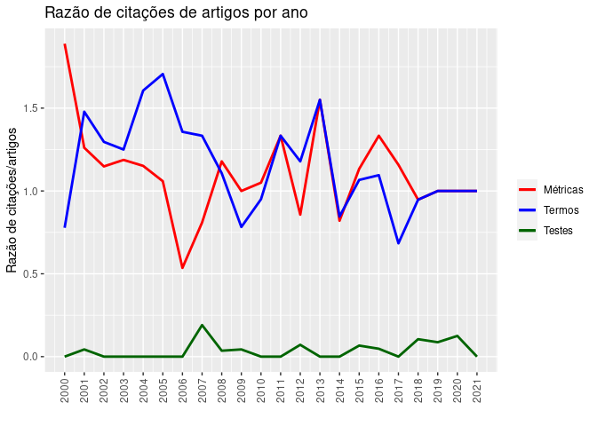

# BIBLIOTECAS

```r
library(ggplot2)
```

# DADOS


```r
metricas <- c(7, 16, 19, 23, 21, 26, 12, 12, 17, 16, 16, 5, 17, 16, 23, 11, 17, 15, 18, 22, 13, 11)

termos <- c(5, 20, 22, 28, 30, 31, 24, 17, 24, 14, 12, 5, 22, 17, 29, 12, 16, 9, 19, 22, 16, 12)

testes <- c(0, 1, 0, 0, 0, 0, 0, 2, 1, 1, 0, 0, 2, 0, 0, 1, 1, 0, 2, 3, 2, 0)

artigos <- c(9, 23, 27, 32, 33, 34, 28, 21, 28, 23, 20, 6, 28, 20, 39, 15, 21, 19, 19, 23, 16, 13)

citacao_metricas <- c(17, 29, 31, 38, 38, 36, 15, 17, 33, 23, 21, 8, 24, 31, 32, 17, 28, 22, 18, 23, 16, 13)

citacao_termos <- c(7, 34, 35, 40, 53, 58, 38, 28, 31, 18, 19, 8, 33, 31, 33, 16, 23, 13, 18, 23, 16, 13)

citacao_testes <- c(0, 1, 0, 0, 0, 0, 0, 4, 1, 1, 0, 0, 2, 0, 0, 1, 1, 0, 2, 2, 2, 0)
```

# PERCENTUAIS


```r
metricas_ano <- c()
termos_ano <- c()
testes_ano <- c()

cit_met_ano <- c()
cit_est_ano <- c()
cit_tst_ano <- c()

anos <- seq(2000, 2021, 1)

for (ano in 1:22){
  metricas_ano <- append(metricas_ano, metricas[ano]/artigos[ano]*100)
  termos_ano <- append(termos_ano, termos[ano]/artigos[ano]*100)
  testes_ano <- append(testes_ano, testes[ano]/artigos[ano]*100)
  
  cit_met_ano <- append(cit_met_ano, citacao_metricas[ano]/artigos[ano])
  cit_est_ano <- append(cit_est_ano, citacao_termos[ano]/artigos[ano])
  cit_tst_ano <- append(cit_tst_ano, citacao_testes[ano]/artigos[ano])
  
}
```

# DATAFRAMES


```r
df_dados <- data.frame(anos, artigos, metricas, termos, testes)

df_percent <- data.frame(anos, metricas_ano, termos_ano, testes_ano)

df_citacao <- data.frame(anos, cit_met_ano, cit_est_ano, cit_tst_ano)
```

# GRÁFICOS


```r
colors <- c("Métricas" = "red", "Termos" = "blue", "Testes" = "darkgreen")

ggplot(data=df_percent, aes(x=anos)) + 
  geom_line(aes(y = metricas_ano, color="Métricas"), size=1) +
  geom_line(aes(y = termos_ano, color="Termos"), size=1) +
  geom_line(aes(y = testes_ano, color="Testes"), size=1) +
  scale_x_continuous(breaks = anos, guide = guide_axis(angle = 90)) +
  scale_color_manual(values = colors) +
  labs(title = "Proporção de artigos com citação por ano", x = "", y = "% de artigos", color = "")
```

<!-- -->

```r
ggplot(data=df_citacao, aes(x=anos)) + 
  geom_line(aes(y = cit_met_ano, color="Métricas"), size=1) +
  geom_line(aes(y = cit_est_ano, color="Termos"), size=1) +
  geom_line(aes(y = cit_tst_ano, color="Testes"), size=1) +
  scale_x_continuous(breaks = anos, guide = guide_axis(angle = 90)) +
  scale_color_manual(values = colors) +
  labs(title = "Razão de citações de artigos por ano", x = "", y = "Razão de citações/artigos", color = "")
```

<!-- -->

# ANOVA


```r
df_dados[1:19, 'situacao'] <- "velho"

df_dados[20:22, 'situacao'] <- "novo"

df_dados
```

```
##    anos artigos metricas termos testes situacao
## 1  2000       9        7      5      0    velho
## 2  2001      23       16     20      1    velho
## 3  2002      27       19     22      0    velho
## 4  2003      32       23     28      0    velho
## 5  2004      33       21     30      0    velho
## 6  2005      34       26     31      0    velho
## 7  2006      28       12     24      0    velho
## 8  2007      21       12     17      2    velho
## 9  2008      28       17     24      1    velho
## 10 2009      23       16     14      1    velho
## 11 2010      20       16     12      0    velho
## 12 2011       6        5      5      0    velho
## 13 2012      28       17     22      2    velho
## 14 2013      20       16     17      0    velho
## 15 2014      39       23     29      0    velho
## 16 2015      15       11     12      1    velho
## 17 2016      21       17     16      1    velho
## 18 2017      19       15      9      0    velho
## 19 2018      19       18     19      2    velho
## 20 2019      23       22     22      3     novo
## 21 2020      16       13     16      2     novo
## 22 2021      13       11     12      0     novo
```

```r
alfa <- 5/100
k <- 2
n <- length(df_dados$situacao)


f_critico <- qf(1 - alfa, df1 = k - 1, df2 = n - k)

f_critico
```

```
## [1] 4.351244
```

```r
aov_metricas <- aov(metricas ~ situacao, df_dados)
aov_testes <- aov(testes ~ situacao, df_dados)
aov_termos <- aov(termos ~ situacao, df_dados)

summary(aov_metricas)
```

```
##             Df Sum Sq Mean Sq F value Pr(>F)
## situacao     1    1.8   1.762   0.062  0.806
## Residuals   20  567.2  28.360
```

```r
summary(aov_testes)
```

```
##             Df Sum Sq Mean Sq F value Pr(>F)  
## situacao     1  3.065  3.0654   4.008  0.059 .
## Residuals   20 15.298  0.7649                 
## ---
## Signif. codes:  0 '***' 0.001 '**' 0.01 '*' 0.05 '.' 0.1 ' ' 1
```

```r
summary(aov_termos)
```

```
##             Df Sum Sq Mean Sq F value Pr(>F)
## situacao     1   11.1   11.10   0.186  0.671
## Residuals   20 1196.4   59.82
```
